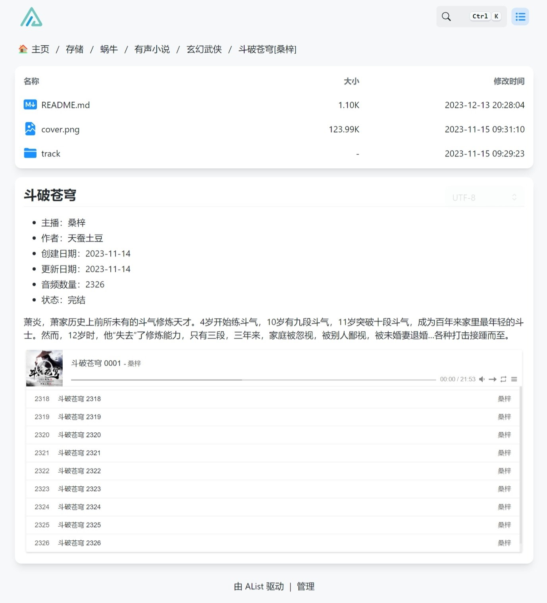
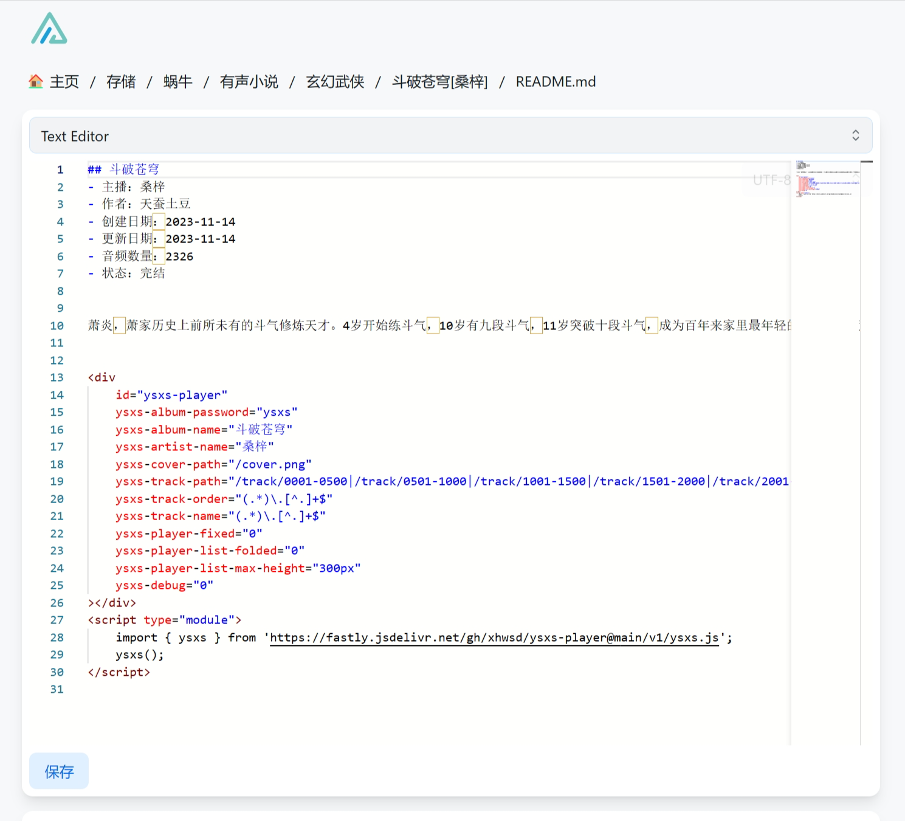

# ysxs-player

### 项目描述
基于Aplayer以Alist为存储实现的有声小说播放器，支持恢复播放集数时间等特性。

### 安装说明
请参考各版本`/v*/ysxs.html`。

### 附加备注
- CDN https://fastly.jsdelivr.net/gh/xhwsd/ysxs-player@main/v1/ysxs.js
- 列表 https://fastly.jsdelivr.net/gh/xhwsd/ysxs-player@main/
- 刷新 https://purge.jsdelivr.net/gh/xhwsd/ysxs-player@main/v1/
